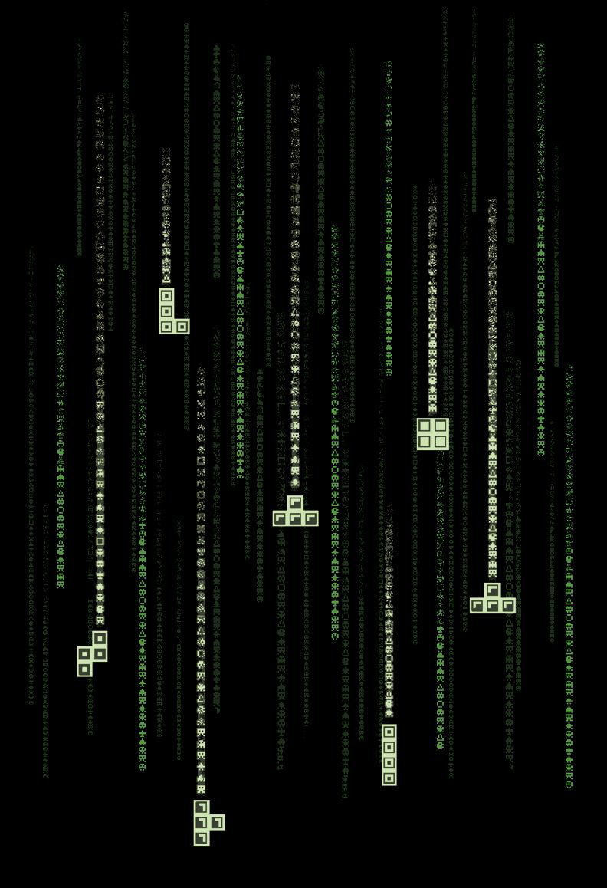

# The TeTris 1.0



## Contents

1. [Introduction](#introduction)  
2. [General information](#general-information)  
  2.1. [BrickGame](#brickgame)  
  2.2. [History](#history)  
  2.3. [Tetris](#tetris)  
3. [Theoretical information](#theoretical-information)  
  3.1. [Finite-state machines](#finite-state-machines)  
4. [Program information](#program-information)  
  4.1. [Program screenshots](#program-screenshots)  
  4.2. [The TeTris 1.0 FSM](#the-tetris-10-fsm)  
  4.3. [Project structure explanation](#project-structure-explanation)  
  4.4. [Technical program sammary](#technical-program-sammary)


## Introduction

The project consist of two parts: a library that implements the Tetris game's logic (which can be connected to various GUIs) and a terminal interface.

## General information

### BrickGame

BrickGame is a popular handheld console from the 90s with several ~~thousands~~ of built-in games developed in China. Originally, it was a copy of Tetris, developed in the USSR and released by Nintendo as part of the GameBoy platform, but also included many other games that were added over time. The console had a small screen with a 10x20 size playing field, which was a matrix of "pixels". There was a scoreboard to the right of the field with a digital display of the current game status, records and other additional information. The most popular games on BrickGame were Tetris, Tanks, Racing, Frogger, and Snake.

### History

Tetris was created on an Electronica-60 computer by Alexey Pajitnov on June 6, 1984. The game was a puzzle based on the use of "tetraminoes" - shaped pieces consisting of four squares. The first commercial version of the game was released in America in 1987. In the following years, Tetris was ported to many different devices, including cell phones, calculators, and PDAs.

The most popular version of Tetris is the one for the Game Boy and NES consoles. But there are various versions of the game apart from it. For example, there's a version with three-dimensional pieces or a dueling version where two players get the same pieces and try to beat each other on points.

### Tetris

Tetris is probably one of the most popular games for the Brickgame console. It's not rare for the console itself to be referred to as Tetris. The goal of the game is to score points for building lines from the blocks generated by the game. The next block generated by the game starts moving down the playing field until it reaches the lower boundary or collides with another block. The user can rotate the pieces and move them horizontally, trying to make rows. Once filled, the row is destroyed, the player gets points, and the blocks above the filled row go down. The game ends when the next piece stops in the topmost row.


## Theoretical information

### Finite-state machines

A finite-state machine (FSM) in the theory of algorithms is a mathematical abstraction, a model of a discrete device that has **one entry**, **one exit** and at each moment of time is in one state out of a set of possible states.

During operation, the input of the FSM sequentially receives entry actions, and at the output the FSM generates exit signals. Transition from one internal state to another can occur not only from external action, but also spontaneously.

FSM can be used to describe algorithms for solving certain problems, as well as for modeling almost any process. A few examples:

- Artificial intelligence logic for games;
- Syntactic and lexical analysis;
- Complex application network protocols;
- Streaming data  

## Program information

### Program screenshots 

  
  
  


### The TeTris 1.0 FSM

  

### Project structure explanation
#### BrickGame game collection v. 1.0

This project meant to be first in the BrickGame series. There probably will be like four projects, each with its own game that will be workable with one GUI.  In addition to developing new projects, old games and projects will get  support and upgrades too. In order to support old and new games, it is necessary to determine in advance how the API of interfaces and libraries will be organized, so that in the future rewriting can be minimal.

The game field is a matrix of ten by twenty dimension. Each element of the matrix corresponds to a "pixel" of the game field and can be in one of two states: empty or filled. In addition to the game field, each game has additional information that is displayed in the sidebar to the right of the game field. Stubs is provided for additional information that is not used during the game.
``` C
typedef struct {
    int **field;
    int **next;
    int score;
    int high_score;
    int level;
    int speed;
    int pause;
} GameInfo_t;
```

Each game library must have a function that accepts user input. The original console had eight physical buttons: start game, pause, end game, action, and four arrows - let's go with that.
The `userInput` function takes as input the user `action` and an additional parameter `hold`, which is responsible for pressing the button.
```C
typedef enum {
    Start,
    Pause,
    Terminate,
    Left,
    Right,
    Up,
    Down,
    Action
} UserAction_t;

void userInput(UserAction_t action, bool hold);
```

The `updateCurrentState` function is intended to get data for rendering in the interface. It returns a structure containing information about the current state of the game. This function should be called from the interface at some intervals to keep the interface up to date.
```C
GameInfo_t updateCurrentState();
```

### Technical program sammary

|Check/Note|Info|
|---|---|
|✔|Implementation the BrickGame v1.0 aka Tetris program aka The TeTris 1.0| 
|✔|The program is developed in C language of C11 standard using gcc compiler.|
|✔|The program consists of two parts: a library implementing the logic of the tetris game, and a terminal interface (GUI) (done with `ncurses` library).|
|✔|A finite-state machine is used to formalize the logic of the game.|
|✔✔:<br>✔ <br>✔  |The library has a function that accepts user input and a function that outputs a matrix that describes the current state of the playing field:<br> - void userInput(...)<br>- GameInfo_t updateCurrentState()|
|✔|The program library code is located in the `src/brick_game/tetris` folder.|
|✔|The program interface code is located in the `src/gui/cli` folder.|
|✔|The program can be built using a Makefile with the standard set of targets for GNU-programs: *all*, *install*, *uninstall*, *clean*, *dvi*, *dist*, *test*, *gcov_report (and other). Installation directory can be arbitrary.|
|✔|Code is written in Google Style.|
|✔|Full coverage of the library with unit tests, using the `check` library is prepared (inc tests can be run on Darwin/Ubuntu OS). The coverage of the library with game logic with tests is 80+ percent.|
|✔✔:<br>✔<br>✔<br>✔<br>✔<br>✔<br>✔<br>✔<br>✔|The following mechanics are in the game:<br>  - Rotation of pieces;<br>  - Moving pieces horizontally;<br>   - Acceleration of the piece's fall (when the button is pressed, the figure moves all the way down);<br>  - Display of the next piece;<br>  - Destruction of filled raws;<br>  - End of the game when the top border of the playing field is reached;<br>   - Include [all sorts of pieces](  documentation/DICM/Tetrinos.png) from the original game.<br> - After reaching the lower boundary of the field or contacting another figure, the figure stops. After that, the next piece, shown in the preview, is generated.|
|✔✔:<br>✔<br>✔<br>✔<br>✔<br>✔<br>✔<br>✔=(-)<br>✔|Support for all the buttons provided on the physical console for control:<br>  - Start game,<br>  - Pause,<br>  - End game,<br>   - Left arrow - movement of the piece to the left,<br>  - Right arrow - movement of the piece to the right,<br>   - Down arrow - piece falls,<br>   - Up arrow is not used in this game,<br>   - Action (piece rotation).|
|✔|The playing field of game match the dimensions of the console's playing field - ten "pixels" wide and twenty "pixels" high. GUI interface is wider to support square pixies.|
|✔|The library interface correspond to the description and idea from the [Project structure explanation](#project-structure-explanation).|
|✔|The UI supports rendering of the playing field and additional information.|
|✔|Diagram describing the used FSM (its states and all possible transitions) is included in the file and located at: */documentation/DICM/FSM.png*.|
|✔✔:<br>✔<br>✔<br>✔<br>✔|Scoring and game record are implemented:<br>  - scoring;<br>  - storing maximum points.<br>  - The maximum number of points is stored in a file.<br>  - The maximum number of points changes during the game, if the user exceeds the current maximum score.|
|✔|Points are accrued as follows:<br>  - 1 row is 100 points;<br>  - 2 rows is 300 points;<br>  - 3 rows is 700 points;<br>  - 4 rows is 1500 points;|
|✔✔:<br>✔<br>✔<br>✔|Level mechanic is implemented:<br>   - Each time a player gains 600 points, the level increases by 1.<br> - Increasing the level boosts the speed at which the pieces move. <br> - The maximum number of levels is 10.|


